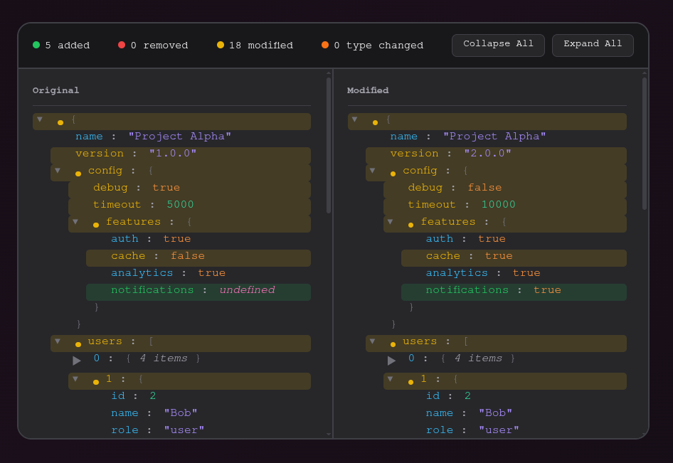

<div align="center">
    
    <h2>json-diff-viewer</h2>
    <h5>
        Compare JSON side-by-side, visually
    </h5>
    <p>
        A zero-dependency web component for visualizing JSON differences
        <br>
        with synchronized scrolling, collapsible nodes, and syntax highlighting
        <br>
        Perfect for debugging, API comparisons, and configuration diffs
    </p>
    
    <h5>
        <a href="https://metaory.github.io/json-diff-viewer-component/" target="_blank">metaory.github.io/json-diff-viewer-component</a>
    </h5>
</div>

## Features

- Deep nested JSON comparison
- Side-by-side synchronized scrolling
- Collapsible nodes (synced between panels)
- Diff indicators bubble up to parent nodes
- Stats summary (added/removed/modified/type-changed)
- Syntax highlighting
- Zero dependencies
- Shadow DOM encapsulation

## Install

```bash
npm i json-diff-viewer-component
```

## Usage

### ES Module

```js
import "json-diff-viewer-component";

const viewer = document.querySelector("json-diff-viewer");
viewer.setData(leftObj, rightObj);
```

### HTML Attributes

```html
<json-diff-viewer
  left='{"name":"foo"}'
  right='{"name":"bar"}'
></json-diff-viewer>
```

### Properties

```js
viewer.left = { name: "foo" };
viewer.right = { name: "bar" };
```

### Method

```js
viewer.setData(leftObj, rightObj);
```

<details>
<summary>Framework Examples</summary>

### React

```jsx
import { useEffect, useRef } from "react";
import "json-diff-viewer-component";

function DiffViewer({ left, right }) {
  const viewerRef = useRef(null);

  useEffect(() => {
    if (viewerRef.current) {
      viewerRef.current.setData(left, right);
    }
  }, [left, right]);

  return <json-diff-viewer ref={viewerRef} />;
}
```

### Vue

```vue
<template>
  <json-diff-viewer ref="viewerRef" />
</template>

<script setup>
import { ref, watch } from "vue";
import "json-diff-viewer-component";

const props = defineProps({
  left: Object,
  right: Object,
});

const viewerRef = ref(null);

watch(
  () => [props.left, props.right],
  () => {
    if (viewerRef.value) {
      viewerRef.value.setData(props.left, props.right);
    }
  },
  { immediate: true },
);
</script>
```

</details>

## Diff Types

| Type         | Color  | Description                          |
| ------------ | ------ | ------------------------------------ |
| Added        | Green  | Key exists only in right             |
| Removed      | Red    | Key exists only in left              |
| Modified     | Yellow | Value changed                        |
| Type Changed | Orange | Type mismatch (e.g. number → string) |

## Styling

Customize the component by overriding CSS custom properties (design tokens) on the `json-diff-viewer` element. All tokens are defined on `:host` and can be overridden from outside the shadow DOM.

### Design Tokens

```css
json-diff-viewer {
  /* Diff colors */
  --add: #22c55e; /* Added items */
  --rem: #ef4444; /* Removed items */
  --mod: #eab308; /* Modified items */
  --typ: #f97316; /* Type changed items */

  /* Backgrounds */
  --bg: #18181b; /* Main background */
  --bg2: #27272a; /* Panel background */

  /* Borders */
  --bdr: #3f3f46; /* Border color */

  /* Text */
  --txt: #fafafa; /* Primary text */
  --dim: #a1a1aa; /* Dimmed/secondary text */

  /* Syntax highlighting */
  --key: #38bdf8; /* Object keys */
  --str: #a78bfa; /* String values */
  --num: #34d399; /* Number values */
  --bool: #fb923c; /* Boolean values */
  --nul: #f472b6; /* Null values */
  --br: #71717a; /* Brackets and braces */
}
```

Create your own theme by overriding these tokens. For example, a light theme:

```css
json-diff-viewer {
  --bg: #fafafa;
  --bg2: #ffffff;
  --bdr: #e4e4e7;
  --txt: #18181b;
  --dim: #71717a;
  --key: #0284c7;
  --str: #7c3aed;
  --num: #059669;
  /* ... override other tokens as needed */
}
```

### Sizing

```css
json-diff-viewer {
  height: 600px;
  border-radius: 16px;
}
```

## Dev

```bash
npm run dev      # start dev server
npm run build    # build for production
```

## License

[MIT](LICENSE)
